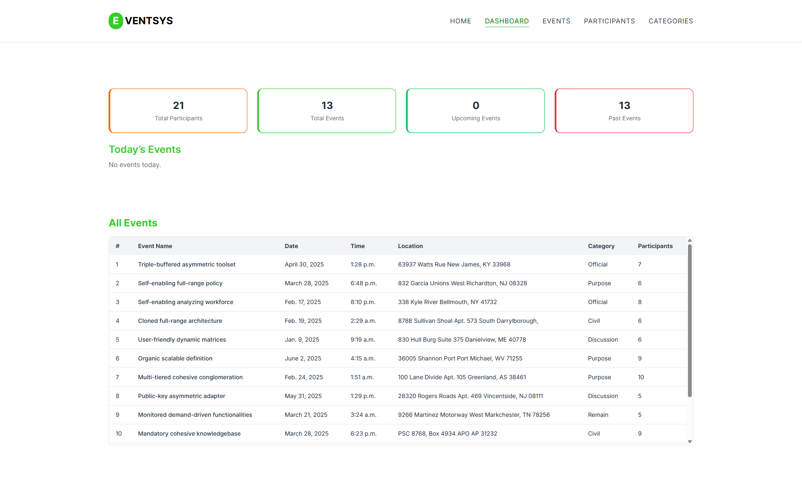
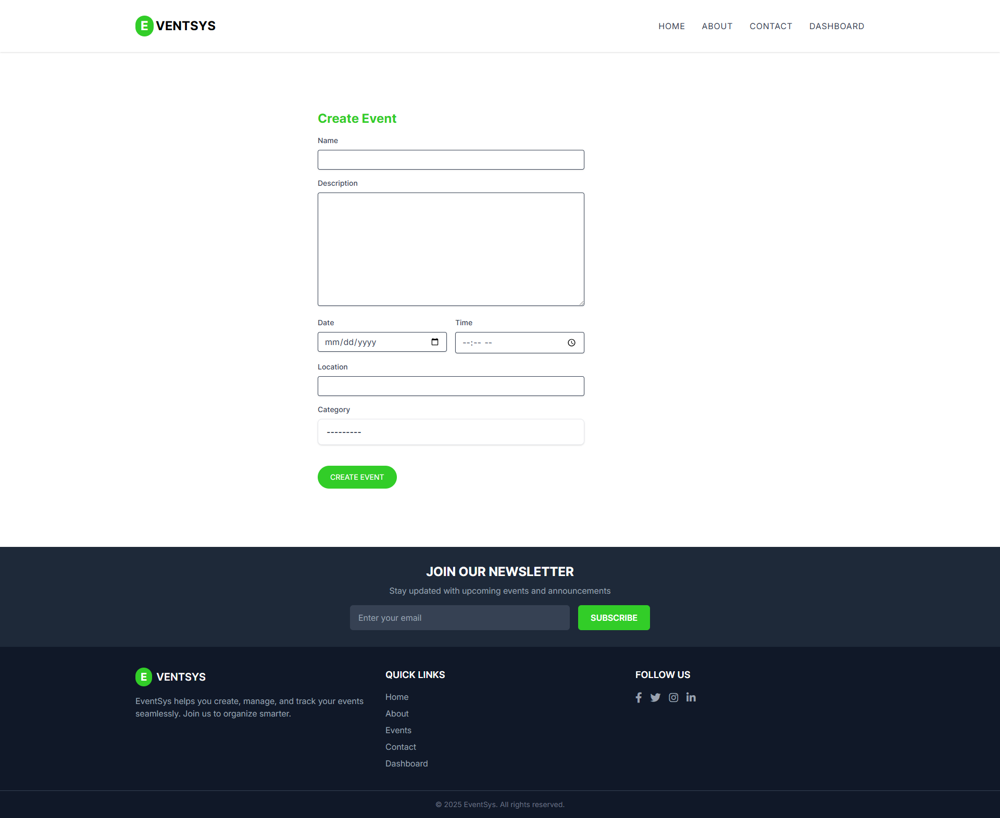

# EventSys - Django Event Management System 🎉

A powerful and responsive event management platform built with **Django**, **Tailwind CSS**, and **SQLite/PostgreSQL**. Organizers can create, manage, and track events and participants with ease.

## 🚀 Live Demo

🌐 [Visit Live Site](https://event-system-sc17.onrender.com)

> Login not required — explore freely. Test all features including event creation, participant management, and dashboard analytics.

## 🌟 Key Highlights

- ⚡ **Fast Performance** - Optimized database queries with `select_related` and `prefetch_related`
- 📱 **Fully Responsive** - Mobile-first design with Tailwind CSS
- 🎨 **Modern UI/UX** - Clean interface with smooth animations and transitions
- 🔒 **Secure** - CSRF protection, form validation, and safe deletion confirmations
- 🚀 **Production Ready** - Configured for deployment with proper static file handling
- 🔄 **Real-time Updates** - Live reload during development
- 📊 **Data Visualization** - Interactive dashboard with event statistics and analytics

## 🔧 Features

- 📝 Create, update, and delete events and categories
- 📅 Assign participants to events
- 🔍 Filter and search events
- 📊 Dashboard with event statistics
- ✅ Form validation with Tailwind styling
- 🔄 Live reload in development via `django-browser-reload`
- 🐞 Debug with `Django Debug Toolbar`

## 🛠 Tech Stack

- **Backend:** Django 5.x (with ORM)
- **Frontend:** Tailwind CSS, Django templates
- **Database:** SQLite (default), PostgreSQL (optional)
- **Tools:** Django Extensions, Django Debug Toolbar

## 📷 Screenshots

| Dashboard                               | Create Event                          |
| --------------------------------------- | ------------------------------------- |
|  |  |

## ⚙️ Setup Instructions

1. **Clone the repo**

```bash
git clone https://github.com/Abdullah149081/event-system.git
cd event-system
```

2. **Install dependencies:**

```bash
pip install -r requirements.txt
```

3. **Set up the database:**

```bash
python manage.py makemigrations
python manage.py migrate
```

4. **Create a superuser (optional):**

```bash
python manage.py createsuperuser
```

5. **Load sample data (optional):**

```bash
python populate_db.py
```

6. **Install Node.js dependencies for Tailwind:**

```bash
npm install  # or pnpm install
```

## 🏃‍♂️ Quick Start

## Development Setup with One Command

You can start the full development environment (including Tailwind CSS watcher and Django server) using the provided PowerShell script.

### Steps to Run

1. Open PowerShell in the project root directory.

2. Run:

   ```powershell
   .\run.ps1
   ```

This script will:

- Automatically activate the Python virtual environment (`venv`)
- Apply any pending Django migrations
- Launch the Tailwind CSS watcher in a new PowerShell window
- Start the Django development server

---

### Requirements

- Windows with PowerShell
- Python virtual environment located at `venv` (adjust `run.ps1` if yours is different)
- Node.js and npm installed (for Tailwind CSS)

---

### Notes

- Make sure you have installed Python dependencies (`pip install -r requirements.txt`) before running the script.
- The Tailwind watcher runs in a separate window so you can watch CSS build logs.
- To stop the development server, press `Ctrl+C` in the terminal running the script.

## 🚀 Usage

### 🏠 Homepage

- Access the app at `http://127.0.0.1:8000/`
- Browse events without registration
- Use filters to find specific events by category or date

### 📊 Dashboard

- Navigate to `/dashboard/` for event management
- View statistics and manage all data
- Access CRUD operations for events, categories, and participants

### 📝 Event Management

- **Create Events:** Fill out the event form with details
- **Update Events:** Edit existing events from the dashboard
- **Delete Events:** Remove events with confirmation dialogs
- **Assign Participants:** Link participants to events

### 👥 Participant Management

- **Add Participants:** Create new participant profiles
- **Manage Events:** Assign participants to multiple events
- **View Details:** Track participant event history

## 🎯 Core Features Breakdown

### 📊 Dashboard Analytics

- **Event Statistics** - Total events, upcoming events, past events
- **Participant Metrics** - Total participants, events per participant
- **Category Analytics** - Events per category with visual indicators
- **Today's Events** - Quick overview of current day activities

### 🎫 Advanced Event Management

- **CRUD Operations** - Complete create, read, update, delete functionality
- **Rich Event Details** - Name, description, date, time, location, category
- **Participant Assignment** - Link multiple participants to events
- **Category Organization** - Organize events by custom categories
- **Search & Filter** - Find events by name, category, or date range

### 👥 Participant System

- **Profile Management** - Complete participant profiles with contact info
- **Multi-event Participation** - Participants can join multiple events
- **Event History** - Track participant's event attendance
- **Email Integration** - Store and manage participant communications

### 🎨 UI/UX Features

- **Responsive Tables** - Horizontal and vertical scrolling for large datasets
- **Sticky Headers** - Table headers remain visible while scrolling
- **Confirmation Dialogs** - Safe deletion with user confirmation
- **Form Validation** - Custom Tailwind-styled forms with validation
- **Loading States** - Smooth transitions and visual feedback

## 🔧 Technical Implementation

### 🏗️ Architecture

- **MVC Pattern** - Clean separation of concerns with Django's MVT
- **Database Optimization** - Efficient queries with `select_related()` and `prefetch_related()`
- **Static File Management** - Organized CSS/JS with Tailwind compilation
- **Template Inheritance** - DRY principle with reusable template components

### 🛡️ Security Features

- **CSRF Protection** - All forms protected against cross-site request forgery
- **SQL Injection Prevention** - Django ORM prevents SQL injection attacks
- **XSS Protection** - Template auto-escaping prevents script injection
- **Secure Headers** - Production-ready security configurations

### 📱 Responsive Design

- **Mobile-First** - Designed for mobile devices, enhanced for desktop
- **Breakpoint System** - Tailwind's responsive utilities for all screen sizes
- **Touch-Friendly** - Optimized buttons and interactions for touch devices
- **Performance** - Optimized images and minimal CSS/JS bundles

## 🚀 Deployment

### 🌐 Production Deployment

The app is configured for easy deployment on platforms like:

- **Render** - Current live demo hosting
- **Heroku** - Easy git-based deployment
- **DigitalOcean** - VPS deployment with Docker
- **Railway** - Modern deployment platform

### 📋 Deployment Checklist

- [ ] Set `DEBUG = False` in production
- [ ] Configure `ALLOWED_HOSTS`
- [ ] Set up static file serving
- [ ] Configure database (PostgreSQL recommended)
- [ ] Set environment variables
- [ ] Run `python manage.py collectstatic`

## 🧪 Testing

```bash
# Run all tests
python manage.py test

# Run specific app tests
python manage.py test events

# Run with coverage
coverage run --source='.' manage.py test
coverage report
```

## 📈 Performance Tips

- **Database Indexing** - Add indexes for frequently queried fields
- **Caching** - Implement Redis/Memcached for production
- **CDN** - Use CDN for static files in production
- **Compression** - Enable Gzip compression
- **Monitoring** - Use Django Debug Toolbar for development insights

## 🙋‍♂️ Author

**Md. Abdullah Al Masud**

- 🌐 **Portfolio:** [abdullah-149081.netlify.app](https://abdullah-149081.netlify.app)
- 💻 **GitHub:** [@Abdullah149081](https://github.com/Abdullah149081)
- 📧 **Email:** abdullah149081@hotmail.com
- 💼 **LinkedIn:** [Connect with me](https://linkedin.com/in/abdullah149081)

---

## 📁 Project Structure

```
event-django/
├── 📁 event_system/          # Django project settings
│   ├── __init__.py
│   ├── settings.py           # Main configuration
│   ├── urls.py              # Root URL configuration
│   ├── wsgi.py              # WSGI configuration
│   └── asgi.py              # ASGI configuration
│
├── 📁 events/               # Main events application
│   ├── 📁 migrations/       # Database migrations
│   ├── 📁 templates/        # HTML templates
│   │   ├── 📁 dashboard/    # Dashboard templates
│   │   │   ├── CategoryDashboard.html
│   │   │   ├── EventDashboard.html
│   │   │   ├── ParticipantDashboard.html
│   │   │   ├── allTable.html
│   │   │   └── stats.html
│   │   ├── 📁 event/        # Event-related templates
│   │   │   ├── category.html
│   │   │   ├── event.html
│   │   │   ├── eventCard.html
│   │   │   ├── eventDetails.html
│   │   │   ├── filter.html
│   │   │   └── search.html
│   │   ├── 📁 form/         # Form templates
│   │   │   ├── CategoryForm.html
│   │   │   ├── EventsForm.html
│   │   │   └── ParticipantForm.html
│   │   ├── 📁 shared/       # Shared components
│   │   │   ├── banner.html
│   │   │   ├── footer.html
│   │   │   └── header.html
│   │   ├── Dashboard.html   # Main dashboard
│   │   └── home.html        # Homepage
│   ├── 📁 static/           # Static files for events app
│   │   └── 📁 assets/
│   │       └── banner.jpg
│   ├── __init__.py
│   ├── admin.py             # Admin interface configuration
│   ├── apps.py              # App configuration
│   ├── context_processors.py # Custom context processors
│   ├── forms.py             # Django forms with Tailwind styling
│   ├── models.py            # Database models (Event, Category, Participant)
│   ├── tests.py             # Unit tests
│   ├── urls.py              # App URL patterns
│   └── views.py             # View functions
│
├── 📁 theme/                # Tailwind CSS integration
│   ├── 📁 css/              # Compiled CSS files
│   │   ├── base.css
│   │   ├── components.css
│   │   ├── style.css
│   │   └── utilities.css
│   ├── 📁 static/           # Static files output
│   │   └── 📁 css/
│   ├── 📁 static_src/       # Tailwind source files
│   │   ├── 📁 src/
│   │   │   └── styles.css
│   │   ├── package.json
│   │   ├── pnpm-lock.yaml
│   │   └── postcss.config.js
│   ├── 📁 templates/        # Base templates
│   │   └── base.html        # Main layout template
│   ├── __init__.py
│   └── apps.py
│
├── 📁 venv/                 # Virtual environment (not in git)
├── 📄 db.sqlite3           # SQLite database
├── 📄 globals.css          # Global CSS styles
├── 📄 manage.py            # Django management script
├── 📄 package.json         # Node.js dependencies
├── 📄 pnpm-lock.yaml       # Package lock file
├── 📄 populate_db.py       # Database seeding script
├── 📄 postcss.config.mjs   # PostCSS configuration
├── 📄 requirements.txt     # Python dependencies
├── 📄 run.ps1              # PowerShell development script
├── 📄 run.py               # Python development script
└── 📄 README.md            # This file
```

### 🤝 Contributing

Contributions are welcome! Please feel free to submit a Pull Request.

1. Fork the project
2. Create your feature branch (`git checkout -b feature/AmazingFeature`)
3. Commit your changes (`git commit -m 'Add some AmazingFeature'`)
4. Push to the branch (`git push origin feature/AmazingFeature`)
5. Open a Pull Request

### 🐛 Bug Reports

If you find a bug, please open an issue with:

- Clear description of the problem
- Steps to reproduce
- Expected vs actual behavior
- Screenshots (if applicable)

### ⭐ Show your support

Give a ⭐️ if this project helped you!

## 📝 Changelog

### v1.0.0 (Current)

- ✅ Initial release with full CRUD functionality
- ✅ Responsive dashboard with analytics
- ✅ Tailwind CSS integration
- ✅ Form validation and error handling
- ✅ Participant-event relationship management
- ✅ Search and filter capabilities

### 🔮 Roadmap

- 🔄 **v1.1.0** - Email notifications for event updates
- 📧 **v1.2.0** - Event registration with QR codes
- 📊 **v1.3.0** - Advanced analytics and reporting
- 🔐 **v1.4.0** - User authentication and permissions
- 📱 **v2.0.0** - Mobile app with React Native

## 🙏 Acknowledgments

- **Django Community** - For the amazing framework
- **Tailwind CSS** - For the utility-first CSS framework
- **Heroicons** - For beautiful SVG icons
- **Font Awesome** - For additional icons
- **GitHub** - For hosting and version control

## 📊 Project Stats


## License

[MIT](LICENSE)
